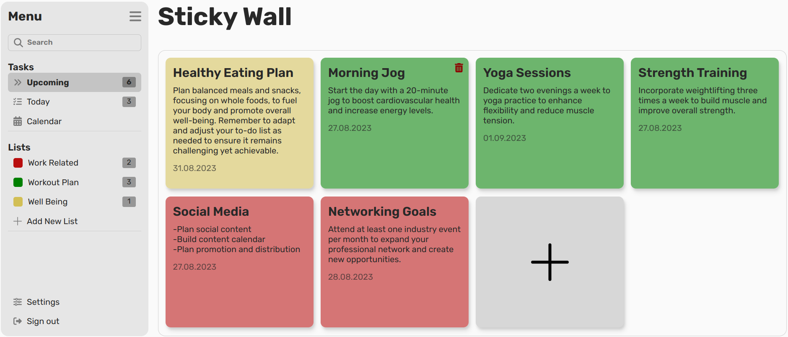

# Todo-List

**Languages and Tools Used:**
HTML, CSS, JS, and tools like Webpack.

**Project Structure:**
- Implement the **Single Responsibility Principle**.
- Separate the core logic from the DOM logic.
- Utilize both factories and classes (Note: While it might not be recommended to use both in a project, I've done so for practice purposes).

**App Features:**
1. **Todo Creation:** You can create todos with a Title, Description, Due Date, and a chosen color.
2. **Project Lists:** Create lists in which todos share the same color.
3. **Todo Deletion:** Remove completed todos.
4. **List Deletion:** Delete lists by right-clicking to open the context menu.
5. **Stores Data:** The app stores data in your browser's local storage.

**Preview:**

